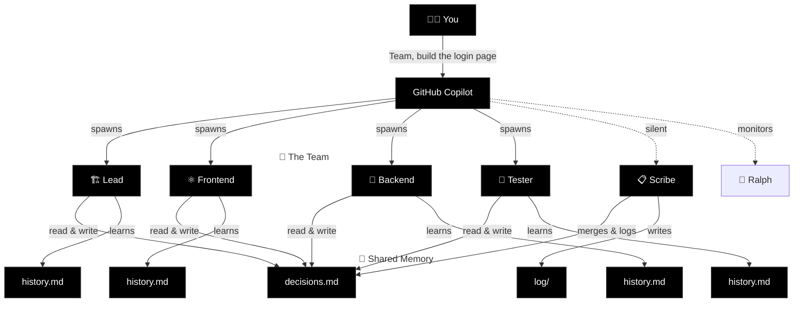

# Squad

**AI agent teams for any project.** A team that grows with your code.

[](#status)
[](#how-it-works)

📣 **[Join the Squad Community](docs/community.md)** — meet contributors, see deployments, share your work.

---

## What is Squad?

Squad gives you an AI development team through GitHub Copilot. Describe what you're building. Get a team of specialists — frontend, backend, tester, lead — that live in your repo as files. They persist across sessions, learn your codebase, share decisions, and get better the more you use them.

It's not a chatbot wearing hats. Each team member runs in its own context, reads only its own knowledge, and writes back what it learned.

---

## Quick Start

### 1. Create your project

```bash
mkdir my-project && cd my-project
git init
```

### 2. Install Squad

```bash
npx github:bradygaster/squad
```

This installs the Squad agent, 10 GitHub Actions workflows for automation (Ralph heartbeat, CI, triage, etc.), templates, and starter skills.

### 3. Authenticate with GitHub (for Issues, PRs, and Ralph)

```bash
gh auth login
```

If you plan to use [Project Boards](docs/features/project-boards.md), add the `project` scope:

```bash
gh auth refresh -s project
```

### 4. Open Copilot and go

```
copilot
```

**In the GitHub Copilot CLI**, type `/agent` and select **Squad (vX.Y.Z)**.  
**In VS Code**, type `/agents` and select **Squad (vX.Y.Z)**.

Then:

```
I'm starting a new project. Set up the team.
Here's what I'm building: a recipe sharing app with React and Node.
```

Squad proposes a team — each member named from a persistent thematic cast. You say **yes**. They're ready.

---

## Agents Work in Parallel — You Catch Up When You're Ready

Squad doesn't work on a human schedule. When you give a task, the coordinator launches every agent that can usefully start — simultaneously. Frontend, backend, tests, architecture — all at once.

```
You: "Team, build the login page"

  🏗️ Lead — analyzing requirements...          ⎤
  ⚛️ Frontend — building login form...          ⎥ all launched
  🔧 Backend — setting up auth endpoints...     ⎥ in parallel
  🧪 Tester — writing test cases from spec...   ⎥
  📋 Scribe — logging everything...             ⎦
```

When agents finish, the coordinator immediately chains follow-up work — tests reveal edge cases, the backend agent picks them up, no waiting for you to ask. If you step away, a breadcrumb trail is waiting when you get back:

- **`decisions.md`** — every decision any agent made, merged by Scribe
- **`orchestration-log/`** — what was spawned, why, and what happened
- **`log/`** — full session history, searchable

**Knowledge compounds across sessions.** Every time an agent works, it writes lasting learnings to its `history.md`. After a few sessions, agents know your conventions, your preferences, your architecture. They stop asking questions they've already answered.

| | 🌱 First session | 🌿 After a few sessions | 🌳 Mature project |
|---|---|---|---|
| ⚛️ **Frontend** | Project structure, framework choice | Component library, routing, state patterns | Design system, perf patterns, a11y conventions |
| 🔧 **Backend** | Stack, database, initial endpoints | Auth strategy, rate limiting, SQL preferences | Caching layers, migration patterns, monitoring |
| 🏗️ **Lead** | Scope, team roster, first decisions | Architecture trade-offs, risk register | Full project history, tech debt map |
| 🧪 **Tester** | Test framework, first test cases | Integration patterns, edge case catalog | Regression patterns, coverage gaps, CI pipeline |
| 📋 **Scribe** | First session logged | Cross-team decisions propagated | Full searchable archive of every session and decision |
| 🔄 **Ralph** | Board check after first batch | Auto-triage, CI monitoring | Continuous backlog processing, zero idle time |

Each agent's knowledge is personal — stored in its own `history.md`. Team-wide decisions live in `decisions.md`, where every agent reads before working. The more you use Squad, the less context you have to repeat.

**And it's all in git.** Anyone who clones your repo gets the team — with all their accumulated knowledge.

---

## How It Works

### The Key Insight

Each agent gets its **own context window**. The coordinator is thin. Each agent loads only its charter + history. No shared bloat.



### Context Window Budget

Real numbers. No hand-waving. Updated as the project grows.

Both Claude Sonnet 4 and Claude Opus 4 have a **200K token** standard context window. Each agent runs in its own window, so the coordinator is the only shared overhead.

| What | Tokens | % of 200K context | When |
|------|--------|--------------------|------|
| **Coordinator** (squad.agent.md) | ~26,300 | 13.2% | Every message |
| **Agent spawn overhead** (charter ~750 + inlined in prompt) | ~750 | 0.4% | When spawned |
| **decisions.md** (shared brain — read by every agent) | ~32,600 | 16.3% | When spawned |
| **Agent history** (varies: 1K fresh → 12K veteran) | ~1,000–12,000 | 0.5–6.0% | When spawned |
| **Total agent load** (charter + decisions + history) | ~34,000–45,000 | 17–23% | When spawned |
| **Remaining for actual work** | **~155,000–166,000** | **78–83%** | Always |

**v0.4.0 context optimization (Feb 2026):** We ran a context budget audit and found `decisions.md` had ballooned to ~80K tokens (40% of context) after 250+ accumulated decision blocks. Combined with spawn template duplication in the coordinator, agents were working with barely half a context window. Three targeted optimizations shipped:

1. **decisions.md pruning** — 251 blocks → 78 active decisions. Stale sprint artifacts, completed analysis docs, and one-time planning fragments archived to `decisions-archive.md`. Nothing deleted — full history preserved.
2. **Spawn template deduplication** — Three near-identical templates (background, sync, generic) collapsed to one. Saved ~3,600 tokens in the coordinator prompt.
3. **Init Mode compression** — 84 lines of first-run-only instructions compressed to 48 lines. Same behavior, less prose.

**Result:** Per-agent spawn cost dropped from 41–46% to 17–23% of context. Agents now have ~78–83% of their context window for actual work, up from ~54–59%. As your squad runs more sessions and accumulates more decisions, Scribe's history summarization keeps per-agent history bounded. For decisions.md, a Scribe-driven automated pruning system is planned for v0.5.0 (see issue #37) — until then, the archive pattern keeps the shared brain lean.

**The architecture still wins.** Each agent runs in **its own** 200K window. The coordinator's window is separate from every agent's window. Fan out to 5 agents and you're working with **~1M tokens** of total reasoning capacity. The per-agent overhead is real but bounded — and the pruning system ensures it stays that way as your project grows.

### Memory Architecture

| Layer | What | Who writes | Who reads |
|-------|------|-----------|-----------|
| `charter.md` | Identity, expertise, voice | Squad (at init) | The agent itself |
| `history.md` | Project-specific learnings | Each agent, after every session | That agent only |
| `decisions.md` | Team-wide decisions | Any agent | All agents |
| `log/` | Session history | Scribe | Anyone (searchable archive) |

---

## What Gets Created

```
.ai-team/
├── team.md              # Roster — who's on the team
├── routing.md           # Routing — who handles what
├── decisions.md         # Shared brain — team decisions
├── casting/
│   ├── policy.json      # Casting configuration
│   ├── registry.json    # Persistent name registry
│   └── history.json     # Universe usage history
├── agents/
│   ├── {name}/          # Each agent gets a persistent cast name
│   │   ├── charter.md   # Identity, expertise, voice
│   │   └── history.md   # What they know about YOUR project
│   ├── {name}/
│   │   ├── charter.md
│   │   └── history.md
│   └── scribe/
│       └── charter.md   # Silent memory manager
└── log/                 # Session history
```

**Commit this folder.** Your team persists. Names persist. Anyone who clones gets the team — with the same cast.

---

## Growing the Team

### Adding Members

```
> I need a DevOps person.
```

Squad generates a new agent, seeds them with project context and existing decisions. Immediately productive.

### Removing Members

```
> Remove the designer — we're past that phase.
```

Agents aren't deleted. Their charter and history move to `.ai-team/agents/_alumni/`. Knowledge preserved, nothing lost. If you need them back later, they remember everything.

---

## Reviewer Protocol

Team members with review authority (Tester, Lead) can **reject** work. On rejection, the reviewer may require:

- A **different agent** handles the revision (not the original author)
- A **new specialist** is spawned for the task

The Coordinator enforces this. No self-review of rejected work.

---

## What's New in v0.4.0

- [**Client Compatibility**](docs/scenarios/client-compatibility.md) — Full platform support matrix. Squad now works on CLI and VS Code with graceful degradation.
- [**VS Code Support**](docs/features/vscode.md) — First-class VS Code guide. `runSubagent` parallel spawning, platform detection, feature degradation table.
- [**Project Boards**](docs/features/project-boards.md) — GitHub Projects V2 integration. Board + Kanban views synced from labels. `gh auth refresh -s project` required.
- [**Label Taxonomy**](docs/features/labels.md) — 7-namespace label system (status:, type:, priority:, squad:, go:, release:, era:). Labels are the state machine; boards are projections.
- [**Notifications**](docs/features/notifications.md) — Your squad pings you on Teams, iMessage, or Discord when they need input. Zero infrastructure in Squad — bring your own MCP notification server.
- [**MCP Setup Guide**](docs/features/mcp.md) — Step-by-step MCP configuration for CLI and VS Code. Examples: GitHub, Trello, Aspire dashboard.
- [**Plugin Marketplace**](docs/features/plugins.md) — Discover and install curated agent templates and skills from community repositories. Auto-recommend plugins when adding team members.
- **Universe Expansion** — 20 → 33 casting universes (MCU, DC, Stranger Things, The Expanse, Arcane, Ted Lasso, Dune, Cowboy Bebop, Fullmetal Alchemist, Seinfeld, The Office, Adventure Time, Futurama, + 2 more)
- **Docs Growth** — 49 docs across features, scenarios, and guides
- **Context Optimization** — decisions.md pruned from ~80K to ~33K tokens (251 → 78 blocks). Spawn templates deduplicated. Per-agent context usage dropped from 41–46% to 17–23%. Agents now have 78–83% of their context window for actual work.
- **Core Growth** — squad.agent.md: 1,100 → 1,771 lines; index.js: 654 lines; 188+ total commits

---

## What's New in v0.3.0

- [**Per-Agent Model Selection**](docs/features/model-selection.md) — Cost-first routing: code work gets standard-tier models (claude-sonnet-4.5), non-code tasks use fast/cheap models (claude-haiku-4.5). 16-model catalog with fallback chains.
- [**Ralph — Work Monitor**](docs/features/ralph.md) — Built-in squad member that autonomously processes backlogs. Self-chaining work loop: scan GitHub → spawn agents → collect results → repeat.
- [**@copilot Coding Agent**](docs/features/copilot-coding-agent.md) — GitHub's Copilot agent as a squad member. Three-tier capability profile. Auto-assign with workflow.
- **Universe Expansion** — 14 → 20 casting universes (Succession, Severance, Lord of the Rings, Attack on Titan, Doctor Who, Monty Python)
- **Milestones Rename** — "Sprints" → "Milestones" (GitHub-native alignment)
- **Test Growth** — 92 → 118 tests
- **Emoji Fixes** — Test suite encoding standardized

---

## What's New in v0.2.0

- [**Export & Import CLI**](docs/features/export-import.md) — Portable team snapshots for moving squads between repos
- [**GitHub Issues Mode**](docs/features/github-issues.md) — Issue-driven development with `gh` CLI integration
- [**PRD Mode**](docs/features/prd-mode.md) — Product requirements decomposition into work items
- [**Human Team Members**](docs/features/human-team-members.md) — Mixed AI/human teams with routing
- [**Skills System**](docs/features/skills.md) — Earned knowledge with confidence lifecycle
- [**Tiered Response Modes**](docs/features/response-modes.md) — Direct/Lightweight/Standard/Full response depth
- [**Smart Upgrade**](docs/scenarios/upgrading.md) — Version-aware upgrades with migrations

---

## Issue Assignment & Triage

Squad integrates with GitHub Issues. Label an issue with `squad` to trigger triage, or assign directly to a member with `squad:{name}`.

### How It Works

1. **Label an issue `squad`** — the Lead auto-triages it: reads the issue, determines who should handle it, applies the right `squad:{member}` label, and comments with triage notes.

2. **`squad:{member}` label applied** — the assigned member picks up the issue in their next Copilot session (or automatically if Copilot coding agent is enabled).

3. **Reassign** — remove the current `squad:*` label and add a different member's label.

### Labels

Labels are auto-created from your team roster via the `sync-squad-labels` workflow:

| Label | Purpose |
|-------|---------|
| `squad` | Triage inbox — Lead reviews and assigns |
| `squad:{name}` | Assigned to a specific squad member |
| `squad:copilot` | Assigned to @copilot for autonomous coding agent work |

Labels sync automatically when `.ai-team/team.md` changes, or you can trigger the workflow manually.

### Workflows

Squad installs three GitHub Actions workflows:

| Workflow | Trigger | What it does |
|----------|---------|--------------|
| `sync-squad-labels.yml` | Push to `.ai-team/team.md`, manual | Creates/updates `squad:*` labels from roster |
| `squad-triage.yml` | `squad` label added to issue | Lead triages and assigns `squad:{member}` label |
| `squad-issue-assign.yml` | `squad:{member}` label added | Acknowledges assignment, queues for member |

### Prerequisites

- GitHub Actions must be enabled on the repository
- The `GITHUB_TOKEN` needs `issues: write` and `contents: read` permissions
- For @copilot auto-assign: a classic PAT with `repo` scope stored as `COPILOT_ASSIGN_TOKEN` repo secret (see [setup guide](docs/features/copilot-coding-agent.md#copilot_assign_token-required-for-auto-assign))
- For automated issue work: [Copilot coding agent](https://docs.github.com/en/copilot) must be enabled on the repo

### Session Awareness

The coordinator checks for open `squad:{member}` issues at session start and will mention them: *"Hey {user}, {AgentName} has an open issue — #42: Fix auth endpoint timeout. Want them to pick it up?"*

---


## Install

```bash
npx github:bradygaster/squad
```

> **Appears to hang?** npm resolves `github:` packages via `git+ssh://`. If no SSH agent is running, git prompts for your key passphrase — but npm's progress spinner hides the prompt. Fix: start your SSH agent first (`ssh-add`), or run with `npx --progress=false github:bradygaster/squad` to reveal the prompt. See [Troubleshooting](docs/scenarios/troubleshooting.md) for more.

See [Quick Start](#quick-start) for the full walkthrough.

### Upgrade

Already have Squad? Update Squad-owned files to the latest version without touching your team state:

```bash
npx github:bradygaster/squad upgrade
```

This overwrites `squad.agent.md`, `.ai-team-templates/`, and squad workflow files in `.github/workflows/`. It never touches `.ai-team/` — your team's knowledge, decisions, and casting are safe.

### Insider Program

Want the absolute latest features? Install from the **insider branch** for continuous development builds:

```bash
npx github:bradygaster/squad#insider
```

Insiders get new features as they ship, but they may have rough edges. See [Insider Program](docs/insider-program.md) for details — or [CONTRIBUTORS.md](CONTRIBUTORS.md) to learn how to report bugs.

---

## Known Limitations

- **Experimental** — API and file formats may change between versions
- **Node 22+** — requires Node.js 22.0.0 or later (`engines` field enforced)
- **GitHub Copilot CLI & VS Code** — Squad is fully supported on CLI and VS Code (v0.4.0+). For platform-specific feature support (model selection, background mode, SQL tool access), see [Client Compatibility Matrix](docs/scenarios/client-compatibility.md)
- **`gh` CLI required** — GitHub Issues, PRs, Ralph, and Project Boards all need `gh auth login`. Project Boards additionally require `gh auth refresh -s project`
- **Knowledge grows with use** — the first session is the least capable; agents improve as they accumulate history
- **SSH agent required for install** — `npx github:bradygaster/squad` resolves via `git+ssh://`. If no SSH agent is running, npm's progress spinner hides git's passphrase prompt, making install appear frozen. Fix: start your SSH agent first (`ssh-add`), or use `npx --progress=false github:bradygaster/squad`. See [#30](https://github.com/bradygaster/squad/issues/30)

---

## Status

🟣 **Experimental** — v0.4.0-dev. Contributors welcome.

Conceived by [@bradygaster](https://github.com/bradygaster).
