<div align="center">

# Squad

**AI agent teams for any project.**

One file. One click. A team that grows with your code.

[](#status)
[](#how-it-works)

</div>

---

## What is Squad?

Squad gives you an AI development team through GitHub Copilot. Describe what you're building. Get a team of specialists — frontend, backend, tester, lead — that live in your repo as files. They persist across sessions, learn your codebase, share decisions, and get better the more you use them.

It's not a chatbot wearing hats. Each team member runs in its own context, reads only its own knowledge, and writes back what it learned.

```mermaid
graph LR
    U["🧑‍💻 You"] -->|"Team, build the login page"| C["GitHub Copilot"]
    C -->|routes| K["⚛️ Kai — Frontend"]
    C -->|routes| R["🔧 River — Backend"]
    C -->|routes| A["🏗️ Alex — Lead"]
    C -->|routes| T["🧪 Casey — Tester"]
    C -->|silent| S["📋 Scribe"]
    K -->|writes| HK["kai/history.md"]
    R -->|writes| HR["river/history.md"]
    K & R -->|decisions| D["decisions.md"]
    S -->|logs| L["log/"]

    style C fill:#6366f1,color:#fff
    style K fill:#3b82f6,color:#fff
    style R fill:#3b82f6,color:#fff
    style A fill:#3b82f6,color:#fff
    style T fill:#3b82f6,color:#fff
    style S fill:#6b7280,color:#fff
```



---

## Quick Start

### 1. Create your project

```bash
mkdir my-project && cd my-project
git init
```

### 2. Install Squad

<details>
<summary><strong>macOS / Linux</strong></summary>

```bash
gh repo clone bradygaster/squad /tmp/squad -- --depth 1 \
  && mkdir -p .github/agents \
  && cp /tmp/squad/.github/agents/squad.agent.md .github/agents/ \
  && cp -r /tmp/squad/templates .ai-team-templates \
  && rm -rf /tmp/squad
```

</details>

<details>
<summary><strong>Windows (PowerShell)</strong></summary>

```powershell
gh repo clone bradygaster/squad $env:TEMP\squad -- --depth 1
mkdir -Force .github\agents | Out-Null
Copy-Item $env:TEMP\squad\.github\agents\squad.agent.md .github\agents\
Copy-Item -Recurse $env:TEMP\squad\templates .ai-team-templates
Remove-Item -Recurse -Force $env:TEMP\squad
```

</details>

### 3. Open Copilot and go

```
copilot
```

Select **Squad** from the `/agents` list, then:

```
I'm starting a new project. Set up the team.
Here's what I'm building: a recipe sharing app with React and Node.
```

Squad proposes a team. You say **yes**. They're ready.

---

## Your Team Grows With Your Project

Squad agents aren't stateless assistants. They accumulate project-specific knowledge over time.

```mermaid
graph TB
    subgraph W1 ["🌱 Week 1"]
        K1["⚛️ Kai knows: React project structure"]
        R1["🔧 River knows: Express + Postgres stack"]
        A1["🏗️ Alex knows: Project scope, team roster"]
        C1["🧪 Casey knows: Test framework chosen"]
    end
    subgraph W4 ["🌿 Week 4"]
        K4["⚛️ Kai knows: Component library, routing, state patterns"]
        R4["🔧 River knows: Auth with JWT, rate limiting, raw SQL preference"]
        A4["🏗️ Alex knows: Architecture decisions, trade-offs made"]
        C4["🧪 Casey knows: Integration test patterns, edge cases found"]
    end
    subgraph W12 ["🌳 Week 12"]
        K12["⚛️ Kai knows: Design system, performance patterns, accessibility"]
        R12["🔧 River knows: Caching, migrations, monitoring, 47 team decisions"]
        A12["🏗️ Alex knows: Full project history, risk areas, tech debt"]
        C12["🧪 Casey knows: Regression patterns, CI pipeline, coverage gaps"]
    end

    W1 --> W4 --> W12

    style W1 fill:#dbeafe,color:#000
    style W4 fill:#93c5fd,color:#000
    style W12 fill:#3b82f6,color:#fff
```



**How it works:**

- Every time an agent does work, it writes lasting learnings to its `history.md`
- A silent **Scribe** propagates cross-team decisions — when River chooses JWT, Kai finds out
- `decisions.md` is the shared brain — every agent reads it before working
- Session logs in `log/` create a searchable archive of everything that happened

By week 4, your agents know your conventions, your preferences, your architecture. They stop asking questions they've already answered. They start making suggestions informed by your project's actual history.

**And it's all in git.** Anyone who clones your repo gets the team — with all their accumulated knowledge.

---

## How It Works

### The Key Insight

Each agent gets its **own context window**. No shared bloat. The coordinator is ~5KB. Each agent loads only its charter + history. This means:

- **Agents think clearly** — no competing instructions
- **Context stays focused** — each agent sees only what it needs
- **The team scales** — adding members doesn't slow anyone down

### Memory Architecture

| Layer | What | Who writes | Who reads |
|-------|------|-----------|-----------|
| `charter.md` | Identity, expertise, voice | Squad (at init) | The agent itself |
| `history.md` | Project-specific learnings | Each agent, after every session | That agent only |
| `decisions.md` | Team-wide decisions | Any agent | All agents |
| `log/` | Session history | Scribe | Anyone (searchable archive) |

---

## What Gets Created

```
.ai-team/
├── team.md              # Roster — who's on the team
├── routing.md           # Routing — who handles what
├── decisions.md         # Shared brain — team decisions
├── agents/
│   ├── alex/
│   │   ├── charter.md   # Identity, expertise, voice
│   │   └── history.md   # What Alex knows about YOUR project
│   ├── kai/
│   │   ├── charter.md
│   │   └── history.md
│   ├── river/
│   │   ├── charter.md
│   │   └── history.md
│   ├── casey/
│   │   ├── charter.md
│   │   └── history.md
│   └── scribe/
│       └── charter.md   # Silent memory manager
└── log/                 # Session history
```

**Commit this folder.** Your team persists. Anyone who clones gets the team.

---

## Growing the Team

```
> I need a DevOps person.
```

Squad generates a new agent, seeds them with project context and existing decisions. Immediately productive.

```
> Remove the designer — we're past that phase.
```

Knowledge preserved in `.ai-team/agents/_alumni/`. Nothing lost.

---

## Reviewer Protocol

Team members with review authority (Tester, Lead) can **reject** work. On rejection, the reviewer may require:

- A **different agent** handles the revision (not the original author)
- A **new specialist** is spawned for the task

The Coordinator enforces this. No self-review of rejected work.

---

## Install

| What | Where | Purpose |
|------|-------|---------|
| `squad.agent.md` | `.github/agents/` | The coordinator + init |
| `templates/` | `.ai-team-templates/` | Format guides for team generation |

See [Quick Start](#quick-start) for the one-liner.

---

## Status

🟣 **Early access.** Private. Actively building.

Built by the [Beacon](https://github.com/bradygaster/beacon) team — the first Squad-powered product.
Conceived by [@bradygaster](https://github.com/bradygaster).
