# Proposal 006: README Rewrite — "Throw a Squad at It"

**Status:** Superseded — by Proposal 014 (V1 Messaging) and Proposal 019  
**Author:** McManus (DevRel)  
**Date:** 2026-02-07  
**Depends on:** Proposal 002 (Messaging Overhaul) — approved by Brady  
**Reviewer:** Keaton (Lead), Brady (Owner)

---

## Summary

This is the actual README rewrite, following the structure and direction approved in proposal 002. Not an outline. Not a sketch. The complete, copy-paste-ready README.

**What changed from current README:**
- New tagline: "Throw a squad at it."
- New "Why Squad?" section (aggressive tone, per 002)
- Cast System elevated to headline feature section
- Troubleshooting section added
- Sample prompts linked from Quick Start
- Go example references replaced with Python/Node alternatives
- All existing strengths preserved: Quick Start flow, context budget table, mermaid diagram, memory architecture, reviewer protocol

**What did NOT change:**
- The modernization exercise (untouched, per Brady)
- Quick Start 3-step flow (it works)
- Context window budget table (real numbers, gold)
- Mermaid architecture diagram (solid)
- Memory architecture table (clear)
- Reviewer protocol (real differentiator)
- File tree ("What Gets Created")
- Growing the Team / Alumni archive

---

## Full README Content

Everything below the `---COPY START---` and above `---COPY END---` markers is the complete new README.md.

---COPY START---

# Squad

**Throw a squad at it.**

Describe what you're building. Get a team of specialists — frontend, backend, tester, lead — that live in your repo as files. They persist across sessions, share decisions, and get smarter the more you use them.

It's not a chatbot wearing hats — it's a team.

[](#status)
[](#how-it-works)

---

## Quick Start

### 1. Create your project

```bash
mkdir my-project && cd my-project
git init
```

### 2. Install Squad

```bash
npx bradygaster/squad
```

### 3. Open Copilot and go

```
copilot
```

Select **Squad** from the `/agents` list, then:

```
I'm starting a new project. Set up the team.
Here's what I'm building: a recipe sharing app with React and Node.
```

Squad proposes a team — each member named from a persistent thematic cast. You say **yes**. They're ready.

**Not sure where to start?** See [16 ready-to-use prompts](docs/sample-prompts.md) — from pomodoro timers to .NET migrations.

---

## Why Squad?

**Traditional AI agents are chatbots pretending to be teams.** One model, one context, wearing different hats. You ask for backend work, it answers as "Backend Bot." You ask for tests, it answers as "Tester Bot." It's the same agent, roleplaying.

**Squad is different.** Each team member runs in its own context window, reads only its own knowledge, and persists across sessions. When you ask Squad to build a login page:

- The Lead analyzes requirements
- The Frontend builds the UI
- The Backend sets up auth endpoints
- The Tester writes test cases from the spec

**All at once. In parallel. For real.**

Each agent writes what it learned to its own `history.md`. Team-wide decisions go to `decisions.md`. Knowledge compounds. After a few sessions, your team stops asking questions they've already answered.

And it's all in git. Clone the repo → get the team → with all their accumulated knowledge.

**TL;DR:** Squad is what you wish your last AI agent could do. But actually.

---

## Agents Work in Parallel — You Catch Up When You're Ready

Squad doesn't work on a human schedule. It works on a "throw everything at the problem and catch up when you're ready" schedule.

When you give a task, the coordinator launches every agent that can usefully start — simultaneously. Frontend, backend, tests, architecture — all at once.

```
You: "Team, build the login page"

  🏗️ Lead — analyzing requirements...          ⎤
  ⚛️ Frontend — building login form...          ⎥ all launched
  🔧 Backend — setting up auth endpoints...     ⎥ in parallel
  🧪 Tester — writing test cases from spec...   ⎥
  📋 Scribe — logging everything...             ⎦
```

When agents finish, the coordinator immediately chains follow-up work — tests reveal edge cases, the backend agent picks them up, no waiting for you to ask. If you step away, a breadcrumb trail is waiting when you get back:

- **`decisions.md`** — every decision any agent made, merged by Scribe
- **`orchestration-log/`** — what was spawned, why, and what happened
- **`log/`** — full session history, searchable

**Knowledge compounds across sessions.** Every time an agent works, it writes lasting learnings to its `history.md`. After a few sessions, agents know your conventions, your preferences, your architecture. They stop asking questions they've already answered.

| | 🌱 First session | 🌿 After a few sessions | 🌳 Mature project |
|---|---|---|---|
| ⚛️ **Frontend** | Project structure, framework choice | Component library, routing, state patterns | Design system, perf patterns, a11y conventions |
| 🔧 **Backend** | Stack, database, initial endpoints | Auth strategy, rate limiting, SQL preferences | Caching layers, migration patterns, monitoring |
| 🏗️ **Lead** | Scope, team roster, first decisions | Architecture trade-offs, risk register | Full project history, tech debt map |
| 🧪 **Tester** | Test framework, first test cases | Integration patterns, edge case catalog | Regression patterns, coverage gaps, CI pipeline |
| 📋 **Scribe** | First session logged | Cross-team decisions propagated | Full searchable archive of every session and decision |

Each agent's knowledge is personal — stored in its own `history.md`. Team-wide decisions live in `decisions.md`, where every agent reads before working. The more you use Squad, the less context you have to repeat.

**And it's all in git.** Anyone who clones your repo gets the team — with all their accumulated knowledge.

---

## How It Works

### The Key Insight

Each agent gets its **own context window**. The coordinator is thin. Each agent loads only its charter + history. No shared bloat.

```mermaid
graph TB
    U["🧑‍💻 You"] -->|"Team, build the login page"| C["GitHub Copilot"]

    subgraph team [" 🏢 The Team "]
        direction LR
        A["🏗️ Lead"]
        K["⚛️ Frontend"]
        R["🔧 Backend"]
        T["🧪 Tester"]
    end

    C -->|spawns| A
    C -->|spawns| K
    C -->|spawns| R
    C -->|spawns| T
    C -.->|silent| S["📋 Scribe"]

    subgraph memory [" 🧠 Shared Memory "]
        direction LR
        D["decisions.md"]
        L["log/"]
    end

    A & K & R & T -->|read & write| D
    S -->|merges & logs| D
    S -->|writes| L

    A -->|learns| HA["history.md"]
    K -->|learns| HK["history.md"]
    R -->|learns| HR["history.md"]
    T -->|learns| HT["history.md"]

    style U fill:#000,color:#fff,stroke:#333
    style C fill:#000,color:#fff,stroke:#333
    style A fill:#000,color:#fff,stroke:#333
    style K fill:#000,color:#fff,stroke:#333
    style R fill:#000,color:#fff,stroke:#333
    style T fill:#000,color:#fff,stroke:#333
    style S fill:#000,color:#fff,stroke:#333
    style D fill:#000,color:#fff,stroke:#333
    style L fill:#000,color:#fff,stroke:#333
    style HA fill:#000,color:#fff,stroke:#333
    style HK fill:#000,color:#fff,stroke:#333
    style HR fill:#000,color:#fff,stroke:#333
    style HT fill:#000,color:#fff,stroke:#333
    style team fill:none,stroke:#fff,stroke-width:2px,stroke-dasharray:5 5
    style memory fill:none,stroke:#fff,stroke-width:2px,stroke-dasharray:5 5
```



### Context Window Budget

Real numbers. No hand-waving.

| What | Tokens | % of 128K context | When |
|------|--------|-------------------|------|
| **Coordinator** (squad.agent.md) | ~1,900 | 1.5% | Every message |
| **Agent at Week 1** (charter + seed) | ~850 | 0.7% | When spawned |
| **Agent at Week 4** (+ 15 learnings, 8 decisions) | ~1,900 | 1.5% | When spawned |
| **Agent at Week 12** (+ 50 learnings, 47 decisions) | ~5,600 | 4.4% | When spawned |
| **Remaining for actual work** | **~120,000** | **94%** | Always |

The coordinator uses 1.5% of context. A 12-week veteran agent uses 4.4%. That leaves **94% of the context window for reasoning about your code** — not for remembering who it is.

### Memory Architecture

| Layer | What | Who writes | Who reads |
|-------|------|-----------|-----------|
| `charter.md` | Identity, expertise, voice | Squad (at init) | The agent itself |
| `history.md` | Project-specific learnings | Each agent, after every session | That agent only |
| `decisions.md` | Team-wide decisions | Any agent | All agents |
| `log/` | Session history | Scribe | Anyone (searchable archive) |

---

## The Cast System — Agents with Identity

Squad doesn't call your backend developer `Backend_Agent_7829`. It gives them a name. A persistent name. From a thematic universe.

When you initialize a team, Squad picks a universe (The Usual Suspects, Ocean's Eleven, Alien, etc.) and casts roles:

- **Keaton** (The Usual Suspects) → Lead
- **Verbal** → Prompt Engineer
- **McManus** → DevRel
- **Fenster** → Core Dev
- **Hockney** → Tester

Names persist. Stored in `.ai-team/casting/registry.json`. If you clone the repo, you get the same cast. If Keaton made a decision 3 months ago, it's still Keaton. Not "the Lead agent" or "Agent A." **Keaton.**

**Why it matters:**

- Agents feel real. "McManus wrote the docs" is memorable. "Documentation Agent" is not.
- You can reference past work naturally: "Keaton, what did you decide about auth last week?"
- Your team has personality. Not just functionality.

**Cultural fit:** Squad's core team (the one building Squad itself) is cast from *The Usual Suspects*. We eat our own dog food. If it's good enough for us, it's good enough for your project.

---

## What Gets Created

```
.ai-team/
├── team.md              # Roster — who's on the team
├── routing.md           # Routing — who handles what
├── decisions.md         # Shared brain — team decisions
├── casting/
│   ├── policy.json      # Casting configuration
│   ├── registry.json    # Persistent name registry
│   └── history.json     # Universe usage history
├── agents/
│   ├── {name}/          # Each agent gets a persistent cast name
│   │   ├── charter.md   # Identity, expertise, voice
│   │   └── history.md   # What they know about YOUR project
│   ├── {name}/
│   │   ├── charter.md
│   │   └── history.md
│   └── scribe/
│       └── charter.md   # Silent memory manager
└── log/                 # Session history
```

**Commit this folder.** Your team persists. Names persist. Anyone who clones gets the team — with the same cast.

---

## Growing the Team

### Adding Members

```
> I need a DevOps person.
```

Squad generates a new agent, seeds them with project context and existing decisions. Immediately productive.

### Removing Members

```
> Remove the designer — we're past that phase.
```

Agents aren't deleted. Their charter and history move to `.ai-team/agents/_alumni/`. Knowledge preserved, nothing lost. If you need them back later, they remember everything.

---

## Reviewer Protocol

Team members with review authority (Tester, Lead) can **reject** work. On rejection, the reviewer may require:

- A **different agent** handles the revision (not the original author)
- A **new specialist** is spawned for the task

The Coordinator enforces this. No self-review of rejected work.

---

## Install

```bash
npx bradygaster/squad
```

See [Quick Start](#quick-start) for the full walkthrough.

---

## Troubleshooting

**Squad agent doesn't appear in `/agents` list?**
- Restart Copilot CLI: `exit` then `copilot` again.
- Verify `.github/agents/squad.agent.md` exists.
- Check GitHub Copilot CLI version: `copilot --version` (requires 1.220.0+).

**Team isn't spawning?**
- Check `.ai-team/team.md` exists. If not, say: "Initialize the team."
- Verify `.ai-team/decisions.md` exists (Squad needs shared memory).

**Agents aren't learning across sessions?**
- Commit `.ai-team/` to git. If it's in `.gitignore`, agents can't persist.

---

## Status

🟣 **Experimental.** Contributors welcome.

Conceived by [@bradygaster](https://github.com/bradygaster).

---COPY END---

---

## Diff Summary vs Current README

| Section | Change |
|---------|--------|
| **Hero / Tagline** | Replaced "AI agent teams for any project. A team that grows with your code" with "Throw a squad at it." + expanded sub-tagline |
| **What is Squad?** | Merged into hero section. Core message preserved, tighter. |
| **Quick Start** | Added link to sample-prompts.md at the end. 3-step flow unchanged. |
| **Why Squad? (NEW)** | Inserted after Quick Start. Frames against single-agent roleplaying. Aggressive tone per 002. |
| **Agents Work in Parallel** | Added opening line per 002 ("throw everything at the problem"). Rest unchanged. |
| **How It Works** | Unchanged. Mermaid diagram, context budget table, memory architecture all preserved. |
| **Cast System (NEW)** | Elevated from one-line mention to full section. Positioned after How It Works, before What Gets Created. |
| **What Gets Created** | Unchanged. |
| **Growing the Team** | Unchanged. |
| **Reviewer Protocol** | Unchanged. |
| **Install** | Unchanged. |
| **Troubleshooting (NEW)** | Added before Status. Three common issues with fixes. |
| **Status** | Unchanged. |

---

## Notes

- **Go examples:** The current README has no Go references. The Quick Start example already uses React + Node. Sample prompts doc has one Go reference (prompt #13, DevOps Pipeline Builder) — that's a separate change tracked in proposal 002, not in scope for this README rewrite.
- **Demo GIF/video:** Proposal 002 mentions a 2-minute demo GIF in the hero section. Not included here — that's Phase 2 work and needs a production-ready Squad setup first. The hero section is structured to accommodate it when ready.
- **Modernization exercise:** Not touched, per Brady's constraint.

---

## Endorsement

**McManus:** This is the README Squad deserves. "Throw a squad at it" hits before they scroll. "Why Squad?" answers the question every dev asks in the first 10 seconds. Casting elevated from Easter egg to headline feature. Troubleshooting closes the silent drop-off gap. Every section earns its place. Ready for review.
