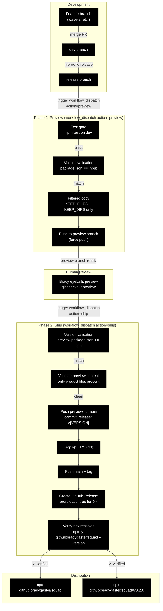

# Release Process

> Internal reference for how code flows from development to users.

## Branch Strategy

| Branch | Purpose | Who pushes | CI |
|--------|---------|------------|-----|
| `wave-*` / feature | Active development | Any agent/contributor | — |
| `dev` | Integration branch | Merge from feature branches | Tests on push (`.github/workflows/ci.yml`) |
| `release` | Staging/testing | Merge from dev when ready | Manual verification |
| `preview` | **Human review checkpoint** | **Only the release workflow (preview phase)** | — |
| `main` | Product-only, release-worthy | **Only the release workflow (ship phase)** | Tests on push (`.github/workflows/ci.yml`) |

### Rules

- **`main` is never directly committed to.** All content arrives via the release workflow's ship phase.
- **`preview` is never directly committed to.** It is built by the release workflow's preview phase and is an exact mirror of what `main` will become.
- **`dev` is the public development branch.** Squad's own `.ai-team/` state lives here (dog-fooding is intentional).
- **Feature branches** (e.g., `wave-2`, `wave-3`) merge into `dev` when complete.
- **`release` branch** is used for pre-release testing and validation before triggering the release workflow.

## Flow Diagram



## What Happens at Each Stage

### 1. Feature Branch → dev

- All code changes happen here: features, bug fixes, docs, tests, agent work.
- The full repo is present — `.ai-team/`, `docs/`, `test/`, `team-docs/`, everything.
- No CI gate on feature branches. Developers run `npm test` locally.
- Merge via PR or direct merge into `dev`.

### 2. dev → release

- Merge `dev` into `release` when the team decides a release is ready.
- Manual testing and verification happen on this branch.
- This is the "are we actually ready?" checkpoint.

### 3. Phase 1: Preview (release workflow, action=preview)

Triggered via **`workflow_dispatch`** from the GitHub Actions UI. Select `preview` as the action and enter the version (e.g., `0.2.0`).

#### Step-by-step:

**a. Test gate**
- Checks out `dev`, runs `npm test` on Node.js 22.x.
- If tests fail, the release is blocked.

**b. Version validation**
- Reads the version from the dispatch input.
- Compares against `package.json` version.
- **Mismatch = hard failure.** The release stops with an error.

**c. Filtered copy**
- Creates a staging directory.
- Copies **only** product files from `dev` (using the shared `KEEP_FILES` and `KEEP_DIRS` env vars):

  **KEEP_FILES:**
  - `index.js`
  - `package.json`
  - `README.md`
  - `LICENSE`
  - `CHANGELOG.md`
  - `.gitignore`
  - `.npmignore`
  - `.gitattributes`
  - `.github/agents/squad.agent.md`

  **KEEP_DIRS:**
  - `templates/`
  - `docs/`

- Everything else is excluded.

**d. Push to preview branch**
- Creates (or force-pushes) the `preview` branch with only the staged product files.
- This branch is an **exact mirror** of what `main` will look like after the release.
- Brady can `git checkout preview` locally to inspect exactly what ships.

### 4. Human Review (between Phase 1 and Phase 2)

- Brady pulls down the `preview` branch: `git checkout preview`
- He reviews the content — it is exactly what will land on `main` and ship to users.
- If something is wrong, fix it on `dev` and re-run the preview phase.
- If it looks good, proceed to Phase 2.

### 5. Phase 2: Ship (release workflow, action=ship)

Triggered via **`workflow_dispatch`** from the GitHub Actions UI. Select `ship` as the action and enter the **same version** used in the preview phase.

#### Step-by-step:

**a. Version validation**
- Checks out the `preview` branch and validates the version matches the dispatch input.

**b. Preview content validation**
- Verifies every file on the `preview` branch is in the `KEEP_FILES` or `KEEP_DIRS` allowlist.
- If any non-product file is found, the ship is **aborted**.

**c. Push to main**
- Switches to `main` (creates as orphan if needed).
- Removes all existing files on `main`.
- Copies preview content into the working tree.
- Commits with message `release: v{VERSION}`.
- This is a **full replacement**, not a merge. `main` is always a clean product snapshot.

**d. Tag and push**
- Creates annotated tag `v{VERSION}`.
- Pushes `main` branch and the new tag.

**e. GitHub Release**
- Creates a GitHub Release on the tag.
- Body includes install, upgrade, and pin commands.
- `prerelease: true` for any `0.x` version.
- `generate_release_notes: true` for automatic changelog from commits.

**f. Verify**
- Waits 15 seconds for GitHub propagation.
- Runs `npx -y github:bradygaster/squad --version` in a clean directory.
- Confirms the release resolves correctly.

## DRY Allowlist

The `KEEP_FILES` and `KEEP_DIRS` arrays are defined **once** as workflow-level environment variables in `.github/workflows/release.yml`. Both the preview and ship phases reference the same `env.KEEP_FILES` and `env.KEEP_DIRS` — no duplication.

## What Ships vs. What Doesn't

### Ships to main (and to users)

| File/Directory | Purpose |
|---|---|
| `index.js` | CLI entry point — init, upgrade, export, import |
| `package.json` | Package metadata, `files` allowlist, version |
| `README.md` | User-facing documentation |
| `LICENSE` | MIT license |
| `.gitignore` | Prevents runtime state from being committed |
| `.npmignore` | Defense-in-depth exclusion for distribution |
| `.gitattributes` | Merge strategies for append-only files |
| `.github/agents/squad.agent.md` | The coordinator agent prompt |
| `templates/` | All template files (charter, history, roster, etc.) |
| `docs/` | User-facing documentation (feature reference, scenarios, guides) |
| `CHANGELOG.md` | Release history and version notes |

### Never ships

| File/Directory | Why excluded |
|---|---|
| `.ai-team/` | Squad Squad's own team state — runtime artifact |
| `.ai-team-templates/` | Internal templates copy |
| `team-docs/` | Internal team documents (proposals, sprints, this file) |
| `test/` | Test suite — only needed on dev for CI |
| `.github/workflows/` | CI/CD workflows — not needed by users |
| `.gitattributes` merge rules | Technically ships but only affects Squad Squad's own merge behavior |

### Three-layer distribution protection

1. **`package.json` `files` field** — Primary gate. Only `index.js`, `.github/agents/squad.agent.md`, `templates/**/*`, `docs/**/*`, and `CHANGELOG.md` are included.
2. **`.npmignore`** — Defense-in-depth. Explicitly excludes `.ai-team/`, `test/`, `team-docs/`, `.github/workflows/`.
3. **Release workflow filtered copy** — `main` branch itself only contains product files.

## CI Pipeline

**File:** `.github/workflows/ci.yml`

```yaml
on:
  push:
    branches: [main, dev]
  pull_request:
    branches: [main]
```

- Runs `npm test` on Node.js 22.x.
- Triggers on: pushes to `main` or `dev`, PRs targeting `main`.
- No build step — Squad is zero-dependency, single-file.

## npx Distribution Model

Squad is distributed **exclusively via GitHub** — no npm publish.

```bash
# Install (latest from main)
npx github:bradygaster/squad

# Upgrade existing installation
npx github:bradygaster/squad upgrade

# Pin to a specific version
npx github:bradygaster/squad#v0.2.0
```

**How it works:**
- `npx github:bradygaster/squad` downloads the tarball from `main` HEAD via `codeload.github.com`.
- npm applies the `files` field from `package.json` before installation — only product files land in `node_modules`.
- The `#v0.2.0` fragment resolves to a git tag, not an npm version. Uses `#` not `@`.
- Because `main` only contains product files (enforced by the release workflow), the tarball is already clean.

## Version Management

- **Source of truth:** `package.json` `version` field.
- **Must match:** The release workflow validates that the requested version matches `package.json`. Mismatch = hard failure.
- **squad.agent.md:** Contains `version: "0.0.0-source"` in the source repo. The `stampVersion()` function in `index.js` (line 350–353) replaces this with the actual version at install/upgrade time.
- **Tag format:** `v{MAJOR}.{MINOR}.{PATCH}` — immutable once created.
- **Pre-v1.0:** All releases are marked `prerelease: true` in GitHub Releases.

## Pre-Release Checklist

Before triggering the release workflow:

1. ☐ All feature branches merged to `dev`
2. ☐ `npm test` passes on `dev` (92 tests, zero failures)
3. ☐ `package.json` version updated to target version
4. ☐ `CHANGELOG.md` has entry for the new version
5. ☐ `squad.agent.md` version header is `"0.0.0-source"` (stamped at install time)
6. ☐ `dev` merged to `release` for final testing
7. ☐ Release workflow triggered: **action=preview**, version entered
8. ☐ Brady reviews `preview` branch (`git checkout preview`)
9. ☐ Release workflow triggered: **action=ship**, same version entered

## Rollback

If a release goes wrong:

1. **Failed preview:** Fix the issue on `dev`, re-run the preview phase.
2. **Failed ship:** Fix the issue, re-run preview, then ship.
3. **Bad content on main:** Delete the tag, force-push main to previous commit, re-release.
4. **Stale npx cache:** Users run `npx -y github:bradygaster/squad` (the `-y` flag bypasses cache).
5. **Nuclear: .ai-team/ corruption:** This cannot happen via upgrade — `.ai-team/` is never touched by the upgrade command. The `test/` suite verifies this invariant.
